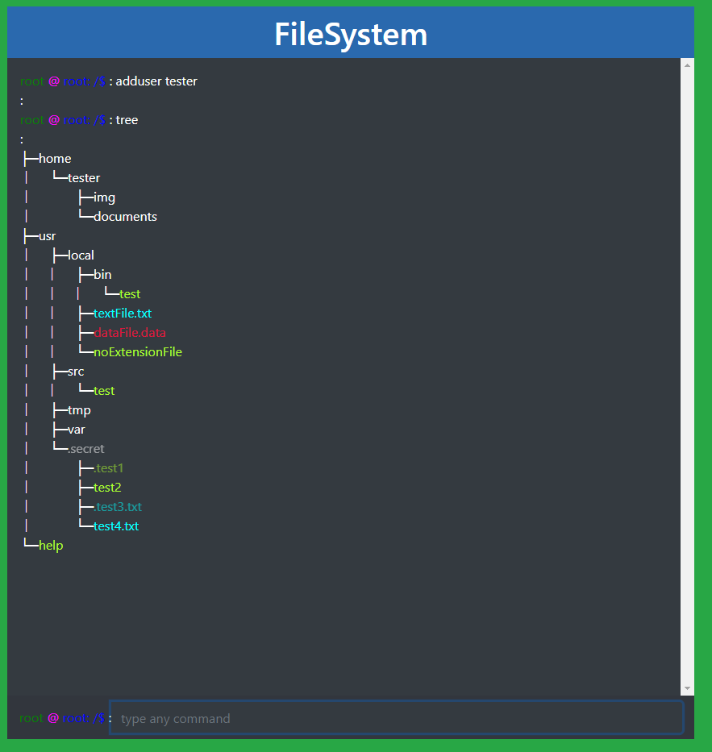

# CLI(Recursion Project6)

## URL
https://nori-ut3g.github.io/CLI/

## 概要
疑似的なコマンドラインです。Recursionの課題の一環で下記コマンドを実装しました。コードはオリジナルです。
(作成日時：2021年2月)


下記コマンドを実装しました。
```angular2html
ls [|filepath] [-option]
pwd []
touch [filePath]
mkdir [filepath]
cd [filepath]
rm [filepath] [-option]
mv [filepath] [filepath]
cp [filepath] [filepath]
```

また、課題にはない下記コマンドも追加しました。

```angular2html
tree [|filepath]
adduser [username]
login [username]
logout
passwd [|username]
chmod [permissionSetting] [filepath]
chown [username|:group|username:group] [filepath]
```


## 各コマンドの特徴
- ls

    カレントディレクトリ内にあるフォルダやファイルの一覧を表示します。-lや-aのようなオプションも実装しました。

- pwd

    カレントディレクトリのフルパスを表示します。

- touch

    指定したファイルがある場合は更新時間を更新し、ない場合は新しいファイルを作成します。 隠しファイルや、拡張子を指定することもできます。

- mkdir

    新しくディレクトリを作成します。

- cd

    カレントディレクトリを移動します。
    /でRootディレクトリ、~でHomeディレクトリ、..で1つ上のディレクトリを指定できます。

- rm

    ファイルやディレクトリを削除します。
    削除前に確認メッセージを表示させ、yesで削除、noでキャンセルします。

- mv

    ファイルやディレクトリを移動します。

- cp

    ファイルやディレクトリをコピーします。
    Linuxとは異なり、第二引数にコピー先のディレクトリを指定する機能だけ実装しました。

- tree

    現在のディレクトリから隠しファイルを含めたすべてのフォルダ、ファイルをツリー表示します。
    拡張子や隠しファイルによってファイル名の色を変えました。

- adduser

    ユーザーを追加します。
    同時にユーザーのホームディレクトリが作成されます。

- login

    指定のユーザーアカウントにログインします。
    パスワードが設定されている場合は、パスワードを設定します。

- logout

    rootユーザーに戻ります。

- passwd

    自分のアカウントにログインパスワードを設定します。
    rootユーザー時は、ユーザーを指定することもできます。
    ハッシュ値でパスワードを保存しています。

- chmod

    ファイルやディレクトリの権限を変更します。
    Linux同様に777のように数値で変更します。
    変更内容は、ls -lで確認できます。

- chown

    ファイルの所有者や所有グループを変更します。
    なお、今回はグループはrootとuserのみです。